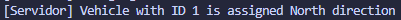

# 🚦 ICB0009-UF3-PR01 - BRIDGE TRAFFIC SIMULATOR
by Alice Aliaga Moreno

## 📋 Project Overview
We must create a server with multiple clients (representing vehicles) that are able to connect to this server.
Each vehicle will identify with a **unique ID** and a **bearing** or either *north* or *south*.
Moreover, the server must manage multiple concurrent connections using **threads* while each client performs its handshake.

This excercise has 7 stages.

## 💡The Solution
The project is composed by:
- **Server**: accepts multiple clients, assigns them an ID and a bearing and manages connections
- **Client**: connects to the server, performs the handshake and remains ready for when I implement the traffic simulation further down the line.
- **NetworkStreamClass**: Auxiliar class that reads and writes data to the NetworkStream safely and reusably.
- **Client (Class)**: It is a data class that represents the clients that are connected to the server with their *Id*, *Stream* and *TCPClient*.

## 🧮 Explanation by Steps
### 📍 Stage 1: Client to Server Connection
- The client creates a TCP connection at `127.0.0.1:5000`
- The server shows a message confirming the connection

### 📍 Stage 2: Client Acceptance
- Each time a client connects, the server will make a **new thread** to manage it
- The server will accept multiple vehicles concurrently
- For each vehicle, the server will declare to be "managing a new vehicle"

### 📍 Stage 3: Assign Unique ID and Bearing
- Upon connection, a client receives: 
    - An incremental ID
    - A random bearing of *North* or *South*
- Assigning is protected by a **lock** to prevent races (pun intended)

### 📍 Stage 4: Obtain the NetworkStream
- Both client and server will obtain the `NetworkStream` of their connection to communicate

### 📍 Stage 5: ReadWrite Methods
- `EscribirMensajeNetworkStream` will write a *string* in the `NetworkStream`
- `LeerMensajeNetworkStream` will read a *string* from the `NetworkStream`
- These methods are implemented inside `NetworkStreamClass` so they can be reused by both client and server

### 📍 Stage 6: HandShake
- Implemented HandShake:
    - Client sends `INIT`
    - Server responds with `ID:<id>, Bearing:<bearing>`
    - Client returns the message for confirmation
    - Server responds with `HANDSHAKE_COMPLETED`

### 📍 Stage 7: Store information of the connected clients
- The server wil store each client into a list protected by `lock`
- Each client contains:
    - Id
    - NetworkStream
    - TCPClient
- Client number is updated upon connection or disconnection
- Clients will remain connected and awaiting. This is so that later on we can simulate the bridge.

*Upon disconnection of a client:*

